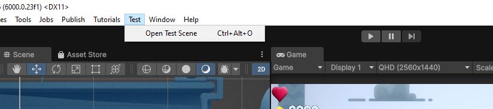

# Platformer Microgame Enhancement

This project is an enhanced version of the Platformer Microgame template from Unity Asset Store. It demonstrates gameplay programming, code structure, and project organization in Unity.

## Table of Contents
- [Setup Instructions](#setup-instructions)
- [Features](#features)
- [Testing the Project](#testing-the-project)
- [Third-Party Assets](#third-party-assets)
- [Packages in Use](#packages-in-use)
- [Platform Support](#platform-support)


## Setup Instructions
### 1. Clone the Repository
```sh
 git clone https://github.com/sonnguyen9800/TestPlf.git
 cd TestPlf
```

### 2. Install Unity
- Ensure you have **Unity 6000.0.23f1 LTS** (or later) installed.

### 3. Open the Project in Unity
1. Open Unity Hub.
2. Click on **Add** and select **Add Project from Disk**.
3. Navigate to the cloned project directory and open it.
4. Unity will load the project (this may take some time).
5. Open the Scene by visit *Test* -> *Open Test Scene*


Or manually find the scene at  `Assets/Scenes/SampleScene.unity`

## Features

### 1. Health System (HP)
- The player has 3 lives.
- Losing a life occurs upon enemy collision or collide to deadzone (upper and lower deadzone)
- When all lives are lost, the player dies and respawn
- UI: Three heart icons at the top-left corner represent remaining lives.

### 2. Coin Counter

- Displays the number of collected coins below the heart icons.

### 3. Damage Effect


- Screen shakes slightly upon enemy collision.
- A red flash effect appears on the screen to indicate damage.

### 4. Bubble Item (Special Item)

- Grants the player the ability to fly upon collection.
- Changes the player's color to yellow.
- Automatically ascends with increasing acceleration.
- Holding the Space key causes the player to descend.
- Releasing the Space key resumes ascent.
- Falling too low results in death (similar to falling off the map).
- If the player collides with obstacles (walls, floor), the ability is removed, and normal movement resumes.
- The ability remains active even when collecting coins or defeating enemies.

You can hit **"F"** to cheat and trigger fly system without taking bubble item.
### 5. Configurable Parameters

- Health and flying speed parameters are adjustable via configuration files located in `Resources/Configs`.
- In the project, another parameter exposed in the config is **CoinValue**, update this to modify coin value retrieved when token claimed.

### Running the Game


1. Open the main scene:  `Assets/Scenes/SampleScene.unity` or Open the Scene by visit *Test* -> *Open Test Scene*
2. Click the **Play** button in Unity Editor.
3. Move the character, collect coins, avoid enemies, and test the special Bubble Item mechanic.


## Third-Party Assets
- **Platformer Microgame** (Unity Asset Store)
- Additional UI icons for Health Icon, also for Bubble Sprite
- Dotween for animation, effect feedback.
- Font *Musician* and font *Musicals*.

## Packages in Use
- **TextMeshPro** (for advanced UI rendering)
- **Cinemachine** (for camera shake effect) and Post Processing Effect
- [Unity Singleton](https://github.com/UnityCommunity/UnitySingleton)
- [Night Pool](https://github.com/MeeXaSiK/NightPool)

## Platform Support
- Developed and tested on **Windows 10**.
- Expected to work on **MacOS** with potential minor adjustments.

